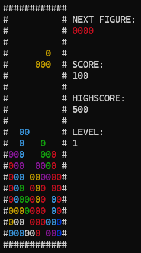
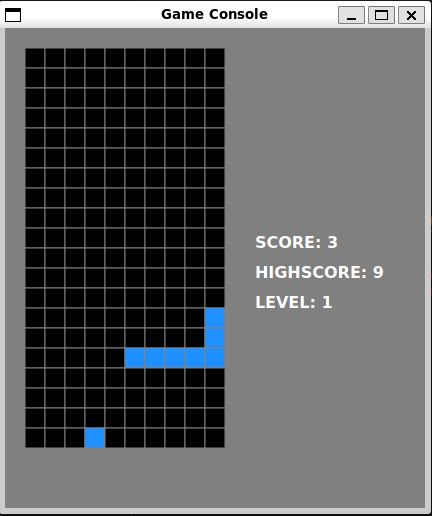

# brick-game

Implementation of the brick game

- Backend `tetris` in C
- Backend `snake` in C++
- Frontend `cli` in C
- Frontend `desktop` in C++ and Qt

Run `make` to build.

The following executables will be built:
- `build/snake_cli`
- `build/snake_desktop`
- `build/tetris_cli`
- `build/tetris_desktop`

